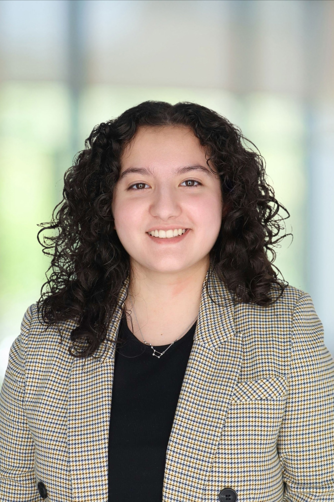

<html lang="en">
<head>
    <meta charset="UTF-8">
    <meta name="viewport" content="width=device-width, initial-scale=1.0">
    <title> Lizette Rodriguez - Physics & Astronomy Undergraduate </title>
    
</head>
<body>
    

    

    <nav>
        

            <ul class="nav-links">
                <li><a href="#home">Home</a></li>
                <li><a href="#about">About</a></li>
                <li><a href="#research">Research</a></li>
                <li><a href="#contact">Contact</a></li>
            </ul>
        

    </nav>

    <section id="home" class="hero">
        

            <svg viewBox="0 0 600 600">
                <circle cx="100" cy="100" r="2" fill="rgba(138, 43, 226, 0.8)"/>
                <circle cx="200" cy="150" r="2" fill="rgba(138, 43, 226, 0.8)"/>
                <circle cx="300" cy="120" r="2" fill="rgba(138, 43, 226, 0.8)"/>
                <circle cx="400" cy="180" r="2" fill="rgba(138, 43, 226, 0.8)"/>
                <circle cx="150" cy="250" r="2" fill="rgba(138, 43, 226, 0.8)"/>
                <circle cx="350" cy="280" r="2" fill="rgba(138, 43, 226, 0.8)"/>
                <circle cx="450" cy="320" r="2" fill="rgba(138, 43, 226, 0.8)"/>
                <circle cx="250" cy="400" r="2" fill="rgba(138, 43, 226, 0.8)"/>
                <circle cx="180" cy="450" r="2" fill="rgba(138, 43, 226, 0.8)"/>
                
                <line x1="100" y1="100" x2="200" y2="150" stroke="rgba(138, 43, 226, 0.3)" stroke-width="1"/>
                <line x1="200" y1="150" x2="300" y2="120" stroke="rgba(138, 43, 226, 0.3)" stroke-width="1"/>
                <line x1="300" y1="120" x2="400" y2="180" stroke="rgba(138, 43, 226, 0.3)" stroke-width="1"/>
                <line x1="150" y1="250" x2="350" y2="280" stroke="rgba(138, 43, 226, 0.3)" stroke-width="1"/>
                <line x1="350" y1="280" x2="450" y2="320" stroke="rgba(138, 43, 226, 0.3)" stroke-width="1"/>
                <line x1="250" y1="400" x2="180" y2="450" stroke="rgba(138, 43, 226, 0.3)" stroke-width="1"/>
            </svg>
        

        

            <h1>Your Name</h1>
            
Physics Undergraduate | Astronomy Enthusiast | Future Researcher

            <a href="#about" class="cta-button">Explore My Universe</a>
        

    </section>

    <section id="about" class="fade-in">
        <h2 class="section-title">About Me</h2>
        

            

            
            

            

                
Lizette Rodriguez is a fourth-year student at UTSA, majoring in physics with a minor in astronomy. She conducts research in planetary nebulae, with her latest focus on utilizing the Chandra X-ray Telescope to perform computational astrophysics on observation NGC 6543, also known as the Cat’s Eye Nebula. Her primary job is to determine how to best use a clustering algorithm called DBSCAN (Density-Based Spatial Clustering of Applications with Noise) to analyze high-energy X-rays emitted from the Cat’s Eye Nebula. 
                In addition to this, Lizette is actively developing a research pipeline centered on open cluster analysis with Gaia data, where she applies statistical methods, dimensionality reduction techniques, and visualization tools to improve the census of local clusters. This work builds on her broader interest in algorithmic applications to astrophysical datasets and connects computational theory with observational evidence.
                In the past, she has participated in other research involving astrophysical radio applications, which included using instrumentation such as antennas and SDRs to better understand phenomena like interference. This experience also allowed her to contribute to a student-led NASA initiative program named CubeSat, a unique collaboration between multiple student organizations, one of which she currently serves as an officer.
                Beyond research, Lizette volunteers for outreach with SPS (Society of Physics Students), where she shares her passion for astronomy and works to make science more accessible to the community.
                

                 
                
Currently pursuing my degree in Physics with a focus on astrophysics, I'm particularly interested in stellar evolution, exoplanet detection, and cosmological phenomena. I believe that through scientific inquiry, we can unlock the secrets of the universe and expand humanity's understanding of our place in the cosmos.

                 
                
When I'm not studying or conducting research, you can find me at the local observatory, participating in astronomy clubs, or working on computational models of celestial mechanics.

            

        

    </section>

    <section id="research" class="fade-in">
        <h2 class="section-title">Research & Projects</h2>
        

            

                <h3>Stellar Classification Analysis</h3>
                
Developing machine learning algorithms to classify stellar spectra and identify unique stellar populations in our galaxy. This project combines computational physics with observational astronomy data.

            

            

                <h3>Exoplanet Transit Modeling</h3>
                
Creating predictive models for exoplanet transit events using Python and astronomical databases. Focus on identifying potentially habitable worlds in nearby star systems.

            

            

                <h3>Dark Matter Simulation</h3>
                
Undergraduate research project simulating dark matter interactions in galactic halos using N-body computational methods and comparing results with observational data.

            

            

                <h3>Radio Astronomy Data Analysis</h3>
                
Processing and analyzing radio telescope data to study pulsars and their magnetic field structures. Collaboration with the local radio astronomy facility.

            

        

    </section>

    <section id="contact" class="fade-in">
        <h2 class="section-title">Get In Touch</h2>
        

            

                
✉️

                <h3>Email</h3>
                
lizette.rodriguez@my.utsa.edu

            

            

                
🔗

                <h3>LinkedIn</h3>
                
www.linkedin.com/in/lizette-rodriguez-295b5b24b

            

            

                
📚

                <h3>GitHub</h3>
                
lizetterod

            

        

    </section>

    
</body>
</html>
